# API Endpoints

This diagram illustrates the API endpoints structure of the Split game application, showing the available routes for interacting with the system.

```mermaid
graph TD
    API[API v1]

    API --> Users[Users]
    API --> Rooms[Rooms]
    API --> Games[Games]
    API --> Bots[Bots]

    Users --> CreateUser[POST /users]
    Users --> LoginAsVisitor[POST /users/login-as-visitor]
    Users --> LoginViaGaas[POST /users/login-via-gaas-token]
    Users --> GetMe[GET /me]

    Rooms --> ListRooms[GET /rooms]
    Rooms --> GetRoom[GET /rooms/:id]
    Rooms --> CreateRoom[POST /rooms]
    Rooms --> CloseRoom[POST /rooms/:id/close]
    Rooms --> KnockKnock[GET /rooms/:id/knock-knock]
    Rooms --> AddAI[POST /rooms/:id/ai_players]

    Games --> GetGame[GET /games/:id]
    Games --> CreateGame[POST /rooms/:id/game]
    Games --> EndGame[DELETE /rooms/:id/game]
    Games --> PlaceStack[POST /games/:id/place-stack]
    Games --> SplitStack[POST /games/:id/split-stack]
    Games --> InitMap[POST /games/:id/init-map-automatically]
```

## API Endpoints Description

### User Management

- **POST /api/v1/users**: Create a new user
- **POST /api/v1/users/login-as-visitor**: Login as a visitor (guest user)
- **POST /api/v1/users/login-via-gaas-token**: Login using a GaaS (Game as a Service) token
- **GET /api/v1/me**: Get current user information

### Room Management

- **GET /api/v1/rooms**: List all available rooms
- **GET /api/v1/rooms/:id**: Get details of a specific room
- **POST /api/v1/rooms**: Create a new room
- **POST /api/v1/rooms/:id/close**: Close a room
- **GET /api/v1/rooms/:id/knock-knock**: Get a token to subscribe to a room's channel
- **POST /api/v1/rooms/:id/ai_players**: Add an AI player to a room

### Game Management

- **GET /api/v1/games/:id**: Get details of a specific game
- **POST /api/v1/rooms/:id/game**: Create a new game in a room
- **DELETE /api/v1/rooms/:id/game**: End a game in a room
- **POST /api/v1/games/:id/place-stack**: Place a stack on the board
- **POST /api/v1/games/:id/split-stack**: Split a stack and move it
- **POST /api/v1/games/:id/init-map-automatically**: Initialize the game map automatically

### Bot Management

- **GET /api/v1/bots**: List all bots
- **POST /api/v1/bots**: Create a new bot
- **GET /api/v1/bots/:id**: Get details of a specific bot
- **PUT /api/v1/bots/:id**: Update a bot
- **DELETE /api/v1/bots/:id**: Delete a bot

The API follows RESTful principles and is organized around the main resources of the application: users, rooms, games, and bots. The endpoints provide the necessary operations to manage these resources and interact with the game system.
