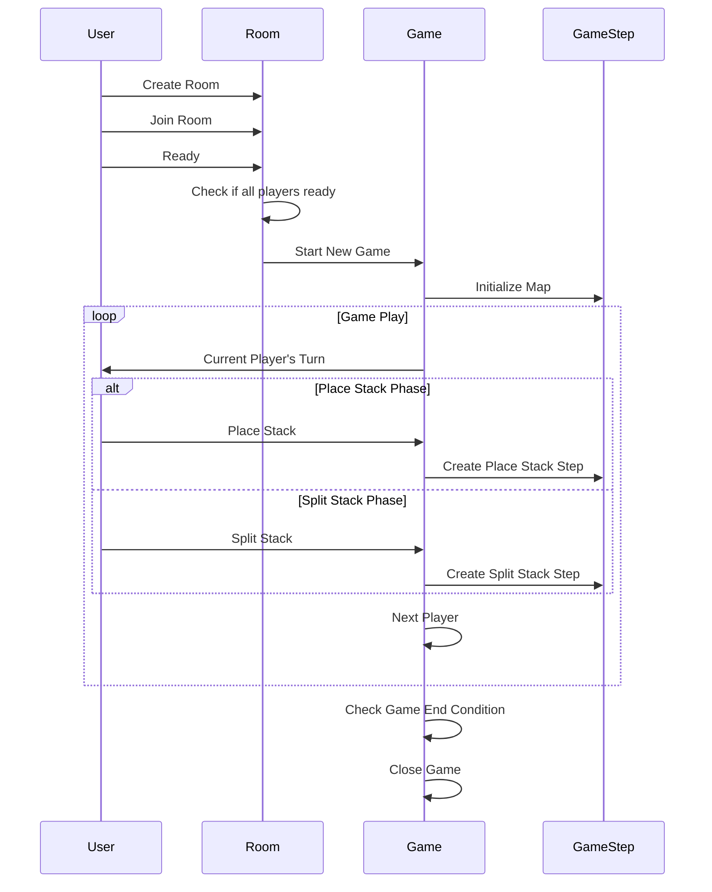

# Game Flow

This sequence diagram illustrates the flow of a typical game session in the Split application, from room creation to game completion.

## Game Flow Explanation

### Room Setup Phase

1. **Create Room**: A user creates a new room
2. **Join Room**: Other users join the room
3. **Ready**: Users mark themselves as ready to play
4. **Check Ready Status**: The room checks if all players are ready
5. **Start Game**: When all players are ready, a new game is started

### Game Initialization

6. **Initialize Map**: The game board is initialized with the hexagonal grid

### Game Play Loop

7. **Player Turns**: The game cycles through player turns
   - In the **Place Stack Phase**, players place their initial stacks on the board
   - In the **Split Stack Phase**, players split their stacks and move them across the board
8. **Next Player**: After each move, the turn passes to the next player

### Game Conclusion

9. **Check End Condition**: The game checks if any player can make a valid move
10. **Close Game**: When no more moves are possible, the game ends

This flow represents the core gameplay loop of the Split game, following the rules outlined in the README. The game progresses from the initial setup phase through the placement of sheep stacks and then into the main gameplay of splitting and moving stacks until no more valid moves are possible.
