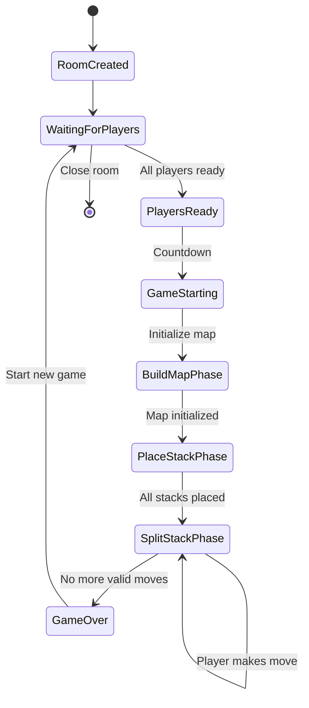

# Game States

This state diagram illustrates the different states a game can be in and the transitions between these states in the Split application.

## Game State Descriptions

### Room States

- **RoomCreated**: Initial state when a room is first created
- **WaitingForPlayers**: Room is open and waiting for players to join and get ready
- **PlayersReady**: All players in the room have marked themselves as ready
- **GameStarting**: Countdown period before the game actually starts

### Game Phase States

- **BuildMapPhase**: The game board is being initialized
- **PlaceStackPhase**: Players are placing their initial stacks on the board
- **SplitStackPhase**: Main gameplay phase where players split and move their stacks
- **GameOver**: The game has ended because no more valid moves are possible

### State Transitions

- **All players ready**: Triggered when all players in a room mark themselves as ready
- **Countdown**: A short countdown period before the game starts
- **Map initialized**: The game board has been set up
- **All stacks placed**: All players have placed their initial stacks
- **Player makes move**: A player splits and moves a stack during their turn
- **No more valid moves**: No player can make a valid move, ending the game
- **Start new game**: Players choose to start a new game in the same room
- **Close room**: The room is closed, ending the session

This state diagram helps visualize the progression of a game session from room creation through the different game phases to completion, and potentially starting a new game or closing the room.
