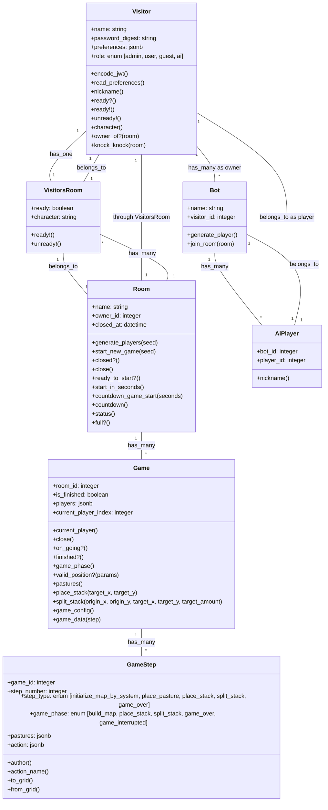

# Models and Relationships

This diagram illustrates the data models in the Split game application and their relationships. The application follows a standard Rails ActiveRecord pattern with models representing game entities.

## Key Model Relationships

- **Visitor**: Represents users in the system with different roles (admin, user, guest, ai)
- **Room**: A virtual room where players gather to play games
- **VisitorsRoom**: Join table connecting visitors to rooms with additional attributes like ready status
- **Game**: Represents a game session with its state and players
- **GameStep**: Records each step/move in a game with detailed information
- **Bot**: Represents an AI bot that can play the game
- **AiPlayer**: Join table connecting bots to visitor records that represent AI players

The diagram shows how these models are interconnected, forming the foundation of the Split game application's data structure.
