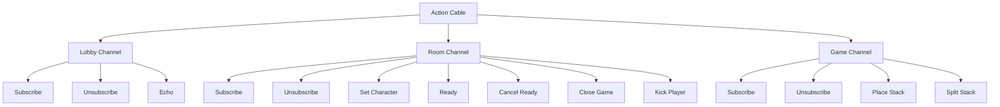

# Real-time Communication Channels

This diagram illustrates the real-time communication channels in the Split game application, showing how WebSockets are used for live updates and interactions.

## Real-time Channels Description

### Lobby Channel

The Lobby Channel broadcasts updates about rooms to all connected users in the lobby.

- **Subscribe**: Connect to the lobby channel
- **Unsubscribe**: Disconnect from the lobby channel
- **Echo**: Test message functionality

Events broadcast on this channel include:

- Room creation
- Players joining/leaving rooms
- Game starting/ending in rooms

### Room Channel

The Room Channel handles communication within a specific room, managing player interactions before and during a game.

- **Subscribe**: Connect to a specific room channel (requires token)
- **Unsubscribe**: Disconnect from a room channel
- **Set Character**: Change a player's character
- **Ready**: Mark a player as ready to start the game
- **Cancel Ready**: Mark a player as not ready
- **Close Game**: End the current game
- **Kick Player**: Remove a player from the room (owner only)

Events broadcast on this channel include:

- Player ready status changes
- Game countdown
- Game start/end notifications

### Game Channel

The Game Channel manages real-time game state updates and player actions during gameplay.

- **Subscribe**: Connect to a specific game channel
- **Unsubscribe**: Disconnect from a game channel
- **Place Stack**: Place a stack on the board
- **Split Stack**: Split a stack and move it

Events broadcast on this channel include:

- Game state updates
- Player moves
- Turn notifications
- Animation events

## WebSocket Implementation

The application uses Rails Action Cable for WebSocket communication, providing real-time updates without requiring page refreshes. This is essential for a multiplayer game where players need immediate feedback on other players' actions.

The channels are implemented in:

- `app/channels/lobby_channel.rb`
- `app/channels/room_channel.rb`
- `app/channels/game_channel.rb`

Client-side connections are managed through JavaScript in:

- `app/javascript/channels/lobby_channel.js`
- `app/javascript/channels/game_channel.js`

This real-time communication architecture enables the interactive multiplayer experience that is central to the Split game.
