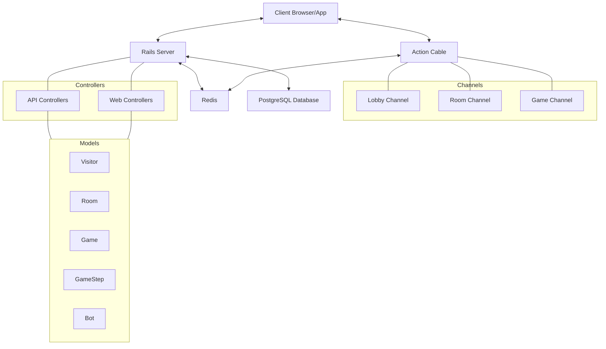

# System Architecture

This diagram illustrates the overall system architecture of the Split game application, showing how different components interact with each other.

## Architecture Components

### Client Layer

- **Client Browser/App**: The frontend application that users interact with, built separately from the Rails backend (as mentioned in the README, the frontend is in a separate repository: https://github.com/side-project-at-SPT/split-front)

### Server Layer

- **Rails Server**: The main application server running Ruby on Rails
- **Action Cable**: Rails' WebSocket framework for real-time features
- **Redis**: Used for caching, Action Cable pub/sub, and storing ephemeral data like room status
- **PostgreSQL Database**: The primary data store for the application

### Application Components

- **Channels**: WebSocket channels for real-time communication

  - **Lobby Channel**: For broadcasting room updates to all users in the lobby
  - **Room Channel**: For communication within a specific room
  - **Game Channel**: For game-specific real-time updates

- **Controllers**:

  - **API Controllers**: RESTful endpoints for the frontend and external services
  - **Web Controllers**: Traditional Rails controllers for web views

- **Models**: ActiveRecord models representing the application's data structure
  - Core models include Visitor, Room, Game, GameStep, and Bot

This architecture follows a standard Rails application pattern with the addition of Action Cable for real-time features, which is essential for a multiplayer game application.
